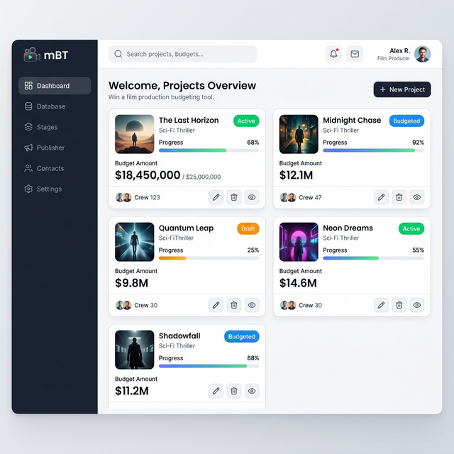

# mBT — mooBudgetTool 

**Offline-first film production budget management. No server. No account. Just open and work.**

mBT is a Progressive Web App for film producers, line producers, and production managers. It runs entirely from a single folder — no internet required after the first load, no installation, no subscriptions.



---

## Quick Start

1. Clone or download this repository
2. Serve the folder with any static file server:

   ```
   npx http-server . -p 3000
   ```

3. Open `http://localhost:3000/index.html` — the Budget Editor
4. Optional — install as a PWA: browser menu → "Install app" / "Add to Home Screen". Launches as a standalone app, fully offline.

Opening `index.html` directly from disk works for a quick look, but offline caching (service worker) and PWA install require serving over HTTP.

---

## Features

### Budget Management
- **Database Builder** — 21 document templates: top sheets, detail budgets, call sheets, purchase orders, petty cash, shooting schedules, script breakdowns, continuity logs, movement orders, storyboards, and funding pitch decks
- **Stages** — model production phases (Pre-roll, Principal, Post/Wrap), allocate budgets per stage, track variance
- **Calendar** — Gantt timeline from stage days, milestone tracking, .ics export
- **Publisher** — export any document as PDF, Excel (XLSX), standalone HTML, or `.moo` project file
- **Export Package** — batch-export all financial documents with a cover page in one click

### Crew & Rates
- **Contacts** — crew and vendor registry with department grouping, rate tracking, dietary/allergy fields, catering summary
- **OpenGate** — open industry rate reference. Jamaica base rates (JMD) with regional multipliers for Caribbean, UK, USA, Canada, and Australia. Named after opening the camera gate: a moment of honesty about what was actually captured. The project is built on the premise that industry knowledge — rates, processes, documentation standards — should not be locked behind years of access. The gate is open.

### Intelligence
- **AI Analytics** — local budget analysis: burn rate, forecast, risk assessment, optimization suggestions, spending patterns, executive summary. No API key required
- **LLM Chat** — connect to LM Studio (local), OpenAI-compatible endpoints, or Claude API for natural language budget queries with full project context injected automatically

### Platform
- **Offline-first** — all data stored locally; works indefinitely without internet
- **Supabase Sync** — optional cloud backup and cross-device sync (Settings -> Cloud Sync)
- **PWA** — installs to home screen on Android and desktop; survives browser refreshes and restarts
- **Dark mode** — full dark theme toggle
- **Compact mode** — reduced row padding, hidden drag handles and variance columns for dense data entry
- **Mobile-responsive** — bottom navigation mode, safe-area insets, touch-sized targets

---

## Architecture

mBT is two separate apps that share tools and data:

| App | Entry Point | Storage | Purpose |
|-----|-------------|---------|---------|
| **Budget Editor** | `index.html` (~9,880 lines) | `localforage` (`prodBudget_v5_*` keys) | Main budget editor. All reconcile, rate, and render logic is inline. Only loads `src/lib/*.js` + `src/scripts/engine/publisher.js` from `src/`. |
| **App Shell** | `src/core/index.html` | IndexedDB (`mBTMonolithDB`) | Navigation hub. Loads `mBT.core.js` and `src/` services. Routes to tools via hash. |

Tools in `src/tools/` are shared between both apps. They receive a `?projectKey=` URL param and read/write budget data via `localforage` directly.

```
mBT/
├── index.html              # Budget Editor (standalone)
├── sw.js                   # Service worker (offline cache)
├── manifest.json           # PWA manifest
├── src/
│   ├── core/
│   │   ├── index.html      # App Shell (nav hub, routes to tools)
│   │   ├── mBT.core.js     # Hash router, theme, nav, settings
│   │   └── services/       # OpenGate.js, Contacts.js, Security.js
│   ├── scripts/
│   │   ├── storage.js      # IndexedDB layer (Shell only)
│   │   └── engine/
│   │       ├── mbtle.js     # Math & currency engine (mBTLE)
│   │       ├── opengate.js  # Shared rate/contact/template engine (mBTOG)
│   │       ├── publisher.js # 21-template document engine (mBTPublisher)
│   │       └── totalizer.js # Budget reconciliation
│   ├── tools/
│   │   ├── ai/             # AI analytics + LLM chat
│   │   ├── calendar/       # Gantt timeline + .ics export (mBTCalendar)
│   │   ├── contacts/       # Crew registry
│   │   ├── db/             # Document Builder (mBTDB)
│   │   ├── publisher/      # Export hub
│   │   ├── rsi/            # RSI health engine + DEBT tracker
│   │   └── stages/         # Stage modelling (mBTStageStudio)
│   ├── config/             # AI config, Supabase config
│   ├── services/           # AI context, patterns, reports, sync
│   └── lib/                # Vendored libraries (offline, no CDN)
├── docs/
│   └── supabase/           # Schema + self-host setup guide
└── tests/                  # Math/storage test suites + browser runner
```

**Stack:** Vanilla JS. No framework, no package.json, no build tools required to run. Libraries (jsPDF, html2pdf, XLSX, localforage, Tailwind, Supabase) are vendored in `src/lib/`.

**Data:** Budget Editor uses `localforage` with key prefix `prodBudget_v5_*`. App Shell uses IndexedDB (`mBTMonolithDB`). Optional Supabase sync via Row Level Security policies (see `docs/supabase/`).

**Naming convention:** All JS namespace objects must be prefixed with `mBT` (e.g. `mBTCalendar`, `mBTStageStudio`, `mBTLE`).

---

## Document Templates

| Category | Templates |
|----------|-----------|
| Financial | Top Sheet, Detail Budget, Cost Report, Purchase Order, Petty Cash |
| Production | Call Sheet, Day Out of Days, Location Agreement, Equipment List, Crew Deal Memo |
| Scheduling | Script Breakdown, Shooting Schedule, Continuity Log, Movement Order, Storyboard |
| Legal/Admin | Release Form, NDA, Permit Request, Insurance Summary |
| Funding | Funding Pitch Deck |
| Reference | Production Bible |

All templates are editable inline, preview in browser, and export to PDF via html2pdf.

---

## Supabase Sync (Optional)

mBT works 100% offline. Supabase sync is optional for cloud backup or multi-device use.

See [`docs/supabase/SETUP.md`](docs/supabase/SETUP.md) for the setup guide.

---

## AI Features

### Local Analytics (no API key needed)
Open the AI tool and use quick commands:
- `budget` — total, spent, remaining, utilization
- `forecast` — 7-day projection with trend
- `risk` — risk level with critical flags
- `suggest` — cost-saving opportunities vs industry benchmarks
- `patterns` — spending pattern detection and anomalies
- `executive` — one-page executive summary

### LLM Chat (requires provider)
Switch to the **LLM Chat** tab, select a provider:
- **LM Studio** — run any GGUF model locally at `localhost:1234`
- **OpenAI-compatible** — any endpoint that accepts the OpenAI chat format
- **Claude API** — Anthropic Claude models via API key

Budget context (project name, total, stage breakdown) is injected as the system prompt automatically.

---

## Browser Support

| Browser | Supported |
|---------|-----------|
| Chrome 90+ | Full |
| Edge 90+ | Full |
| Firefox 88+ | Full |
| Safari 14+ | Full (PWA install via Share → Add to Home Screen) |

Requires IndexedDB API. Works on Android Chrome, iOS Safari, and desktop browsers.

---

## Contributing

mBT is open-source under the MIT license. Issues and PRs welcome.

**Before contributing:**
- No framework dependencies, vanilla JS only
- No CDN references, all libs must be in `src/lib/`
- `var`/`function` not `const`/`let`/`=>` (codebase consistency)
- All JS namespace objects prefixed with `mBT` (e.g. `mBTCalendar`, not `CAL`)
- XSS: all user-controlled strings through `esc()` before DOM insertion
- No emoji in UI, inline SVGs only
- No hardcoded API keys, read from `localStorage`

---

## License

MIT — see [LICENSE](LICENSE).

Copyright (c) 2026 moollc
